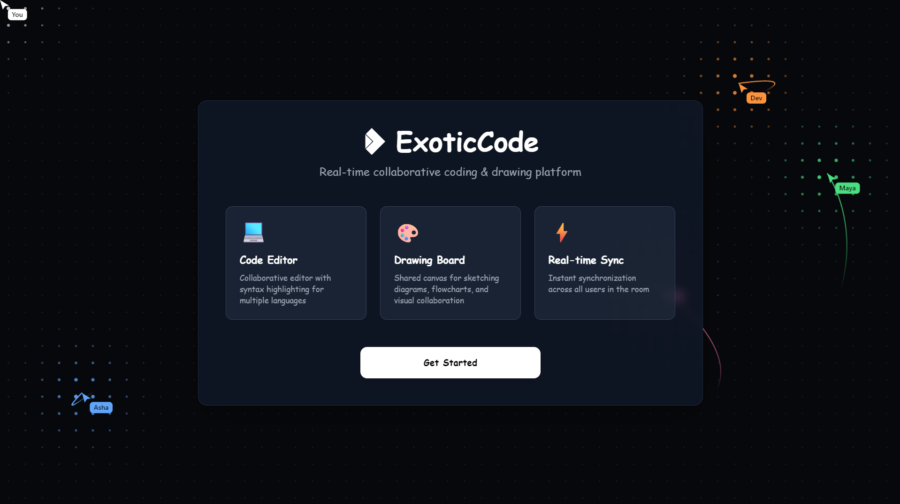

# ExoticCode

A collaborative coding and drawing platform designed for real-time teamwork, planning, and quick technical ideation in one shared space.



## What the app does

ExoticCode combines three core collaboration tools in a single workspace:

- Real-time code editing with Monaco, synced across all users in the same room
- Shared drawing board for diagrams, flowcharts, whiteboarding, and visual explanations
- Room-based collaboration with username and room ID flow for quick team sessions
- Code execution support for JavaScript, TypeScript, Python, Java, C++, and HTML-based snippets through the backend compiler API

## How it works

1. A user creates or joins a room using a username and room code.
2. The frontend connects to a Socket.IO room and syncs editor changes using Yjs + Monaco bindings.
3. All connected users see the same code and drawing updates in real time.
4. The backend exposes a `/v1/execute` endpoint that sends code to the JDoodle API and returns stdout, stderr, and runtime metadata.
5. The drawing board and editor are both tied to the same collaborative room state so teammates can work together without switching tools.

## Project structure

- `frontend/` — React + Vite application for the editor, landing page, collaboration UI, and drawing canvas
- `backend/` — Express + Socket.IO server for room sync and code execution routes
- `backend/controller/executeController.js` — executes user code through the JDoodle API
- `backend/routes/codeRoutes.js` — routes for backend API actions
- `frontend/public/exoticcode-hero.svg` — landing-page hero artwork used to showcase the product

## Tech stack

- Frontend: React, Vite, Monaco Editor, Tailwind CSS, Yjs, Socket.IO collaboration
- Backend: Node.js, Express, Socket.IO, MongoDB-ready structure, JDoodle execution API
- Collaboration: `y-monaco`, `y-socket.io`, and shared room awareness to synchronize users and content

## Run locally

### 1) Install frontend dependencies

```bash
cd frontend
npm install
npm run dev
```

### 2) Install backend dependencies

```bash
cd backend
npm install
npm run dev
```

### 3) Configure environment variables

The backend expects a `.env` file with the required JDoodle credentials and server configuration, for example:

```env
PORT=5000
CLIENT_ID=your_jdoodle_client_id
CLIENT_SECRET=your_jdoodle_client_secret
CLIENT_URL=http://localhost:5173
```

### 4) Open the app

Once both servers are running, visit the Vite frontend URL shown in the terminal (typically `http://localhost:5173`), create a room, and start collaborating.

## Notes

- The app is designed for team collaboration in a single coding session or brainstorming room.
- The editor supports multiple languages and can run code in the browser through the backend API.
- The shared drawing canvas is useful for architecture discussions, design notes, and flow diagrams during live collaboration.
